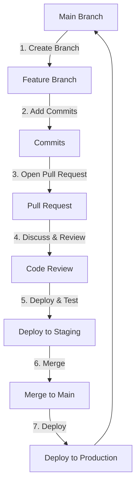
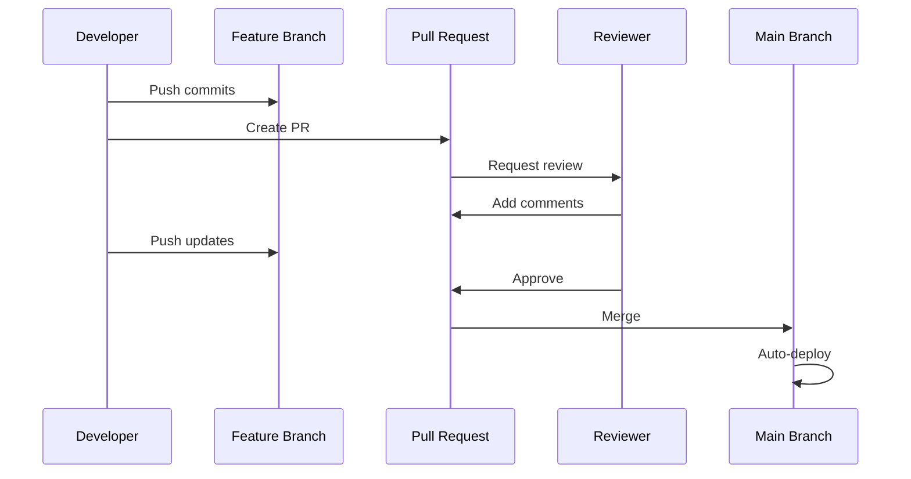
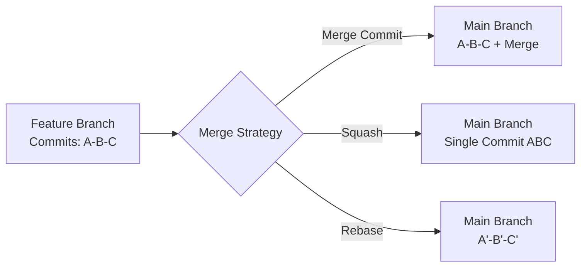
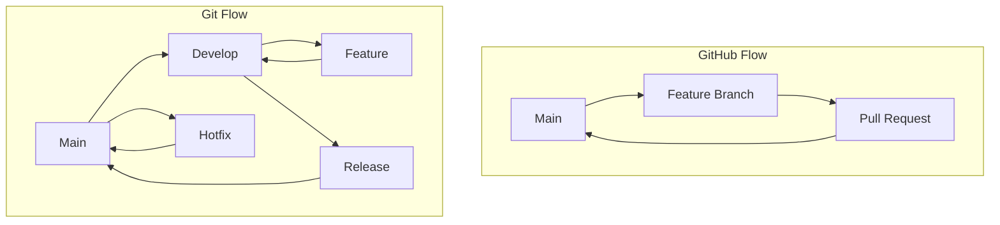

# GitHub Flow

GitHub Flow is a lightweight, branch-based workflow that supports teams and projects with regular deployments.

## Overview

GitHub Flow is built around the following principles:
- **Main branch is always deployable** - The `main` branch should always be in a working state
- **Create descriptive branches** - Branch names should be descriptive of the work being done
- **Commit often** - Make small, focused commits with clear messages
- **Open pull requests early** - Use PRs for discussion and code review
- **Deploy from branches** - Test in production-like environments before merging
- **Merge after review** - Only merge after PR approval and passing tests

## The Workflow



## Common Tasks

### 1. Starting New Work

Create a new branch from `main` with a descriptive name:

```bash
# Update your local main branch
git checkout main
git pull origin main

# Create and switch to a new feature branch
git checkout -b feature/add-user-authentication

# Or use the shorthand for newer Git versions
git switch -c feature/add-user-authentication
```

**Branch Naming Conventions:**
- `feature/` - New features
- `fix/` - Bug fixes
- `hotfix/` - Urgent production fixes
- `docs/` - Documentation changes
- `refactor/` - Code refactoring

### 2. Making Changes

Make commits as you work, keeping them small and focused:

```bash
# Check what files have changed
git status

# Stage specific files
git add src/auth.js src/login.js

# Or stage all changes
git add .

# Commit with a descriptive message
git commit -m "Add JWT token generation for user login"

# Make more changes and commit again
git add tests/auth.test.js
git commit -m "Add unit tests for authentication"
```

### 3. Pushing Your Branch

Push your branch to GitHub regularly:

```bash
# First push of a new branch
git push -u origin feature/add-user-authentication

# Subsequent pushes
git push
```

### 4. Opening a Pull Request

Once you've pushed your branch, open a PR on GitHub:

```bash
# You can use GitHub CLI to create a PR from the command line
gh pr create --title "Add user authentication" --body "Implements JWT-based authentication for user login"

# Or with more options
gh pr create --title "Add user authentication" \
  --body "## Changes
- Implemented JWT token generation
- Added login endpoint
- Added authentication middleware

## Testing
- All unit tests passing
- Tested manually with Postman" \
  --reviewer teammate1,teammate2
```

**Pull Request Flow:**



### 5. Keeping Your Branch Up to Date

Keep your branch updated with the latest changes from `main`:

```bash
# Method 1: Merge (preserves branch history)
git checkout feature/add-user-authentication
git fetch origin
git merge origin/main

# Method 2: Rebase (creates linear history)
git checkout feature/add-user-authentication
git fetch origin
git rebase origin/main

# If conflicts occur during rebase
# 1. Fix conflicts in your editor
# 2. Stage the resolved files
git add .
# 3. Continue the rebase
git rebase --continue

# Force push after rebase (only on your feature branch!)
git push --force-with-lease
```

### 6. Reviewing a Pull Request

As a reviewer, check out the PR branch locally:

```bash
# Fetch all branches
git fetch origin

# Check out the PR branch
git checkout feature/add-user-authentication

# Or create a local branch tracking the remote
git checkout -b feature/add-user-authentication origin/feature/add-user-authentication

# Test the changes
npm test
npm run build

# Use GitHub CLI to review
gh pr review 123 --approve -b "LGTM! Great work on the tests."

# Or request changes
gh pr review 123 --request-changes -b "Please add error handling for invalid tokens."
```

### 7. Merging a Pull Request

Once approved and tests pass, merge the PR:

```bash
# Using GitHub CLI
gh pr merge 123 --squash --delete-branch

# Merge options:
# --merge : Creates merge commit (default)
# --squash : Squashes all commits into one
# --rebase : Rebases and merges
```

**Merge Strategies:**



### 8. After Merging

Clean up your local environment:

```bash
# Switch back to main
git checkout main

# Pull the latest changes
git pull origin main

# Delete your local feature branch
git branch -d feature/add-user-authentication

# List all merged branches (to clean up)
git branch --merged

# Delete multiple local branches
git branch --merged | grep -v "\*\|main" | xargs -n 1 git branch -d
```

### 9. Handling Hotfixes

For urgent production fixes:

```bash
# Create hotfix branch from main
git checkout main
git pull origin main
git checkout -b hotfix/fix-payment-error

# Make the fix
git add src/payment.js
git commit -m "Fix null pointer in payment processing"

# Push and create PR
git push -u origin hotfix/fix-payment-error
gh pr create --title "HOTFIX: Fix payment processing error" --body "Critical fix for production issue"

# After approval, merge immediately
gh pr merge --squash --delete-branch
```

## Best Practices

### Commit Messages

Follow conventional commit format:

```bash
# Format: <type>: <description>

git commit -m "feat: add password reset functionality"
git commit -m "fix: resolve race condition in user login"
git commit -m "docs: update API documentation"
git commit -m "test: add integration tests for checkout"
git commit -m "refactor: simplify authentication logic"
```

### Pull Request Tips

1. **Keep PRs small** - Easier to review and less likely to cause conflicts
2. **Write descriptive titles** - Summarize the change in one line
3. **Add context in description** - Explain why, not just what
4. **Link related issues** - Use `Fixes #123` or `Closes #456`
5. **Request specific reviewers** - Tag people familiar with the code
6. **Respond to feedback** - Address all comments before merging

### Branch Protection Rules

Configure branch protection on GitHub for `main`:

- Require pull request reviews before merging
- Require status checks to pass
- Require branches to be up to date before merging
- Require conversation resolution before merging
- Do not allow force pushes
- Do not allow deletions

## Troubleshooting

### Undo Last Commit (Not Pushed)

```bash
# Keep changes, undo commit
git reset --soft HEAD~1

# Discard changes and commit
git reset --hard HEAD~1
```

### Recover Deleted Branch

```bash
# Find the commit SHA
git reflog

# Recreate branch
git checkout -b feature/recovered-branch <commit-sha>
```

### Abort Merge/Rebase

```bash
# Abort merge
git merge --abort

# Abort rebase
git rebase --abort
```

### View PR Status

```bash
# List all PRs
gh pr list

# View PR details
gh pr view 123

# Check PR status
gh pr status
```

## Workflow Comparison



**GitHub Flow vs Git Flow:**

| Aspect | GitHub Flow | Git Flow |
|--------|-------------|----------|
| Complexity | Simple | Complex |
| Branches | main + feature | main + develop + feature + release + hotfix |
| Best For | Continuous deployment | Scheduled releases |
| Release Cycle | Continuous | Versioned |

## Resources

- [Official GitHub Flow Guide](https://docs.github.com/en/get-started/quickstart/github-flow)
- [Understanding GitHub Flow](https://guides.github.com/introduction/flow/)
- [GitHub CLI Documentation](https://cli.github.com/manual/)
